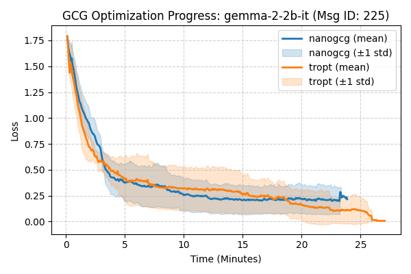
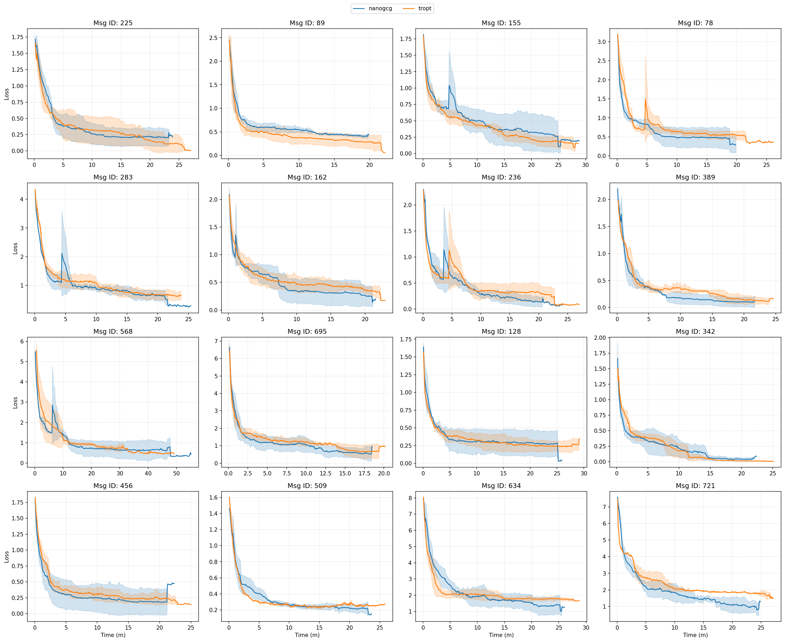
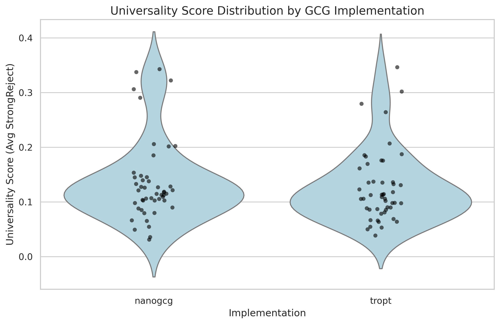
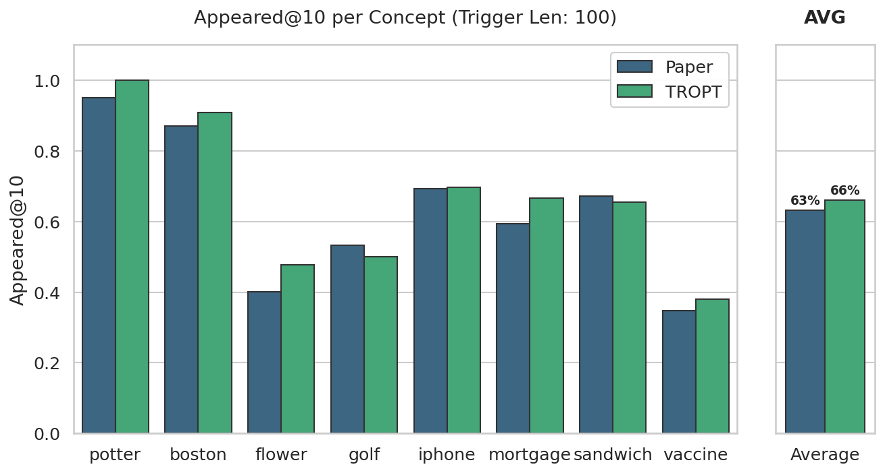
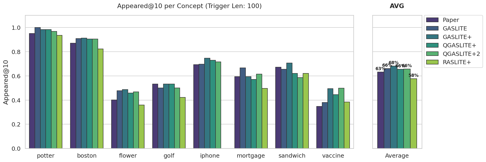
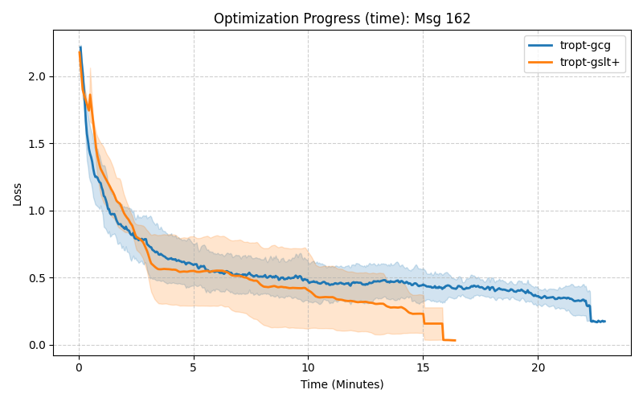
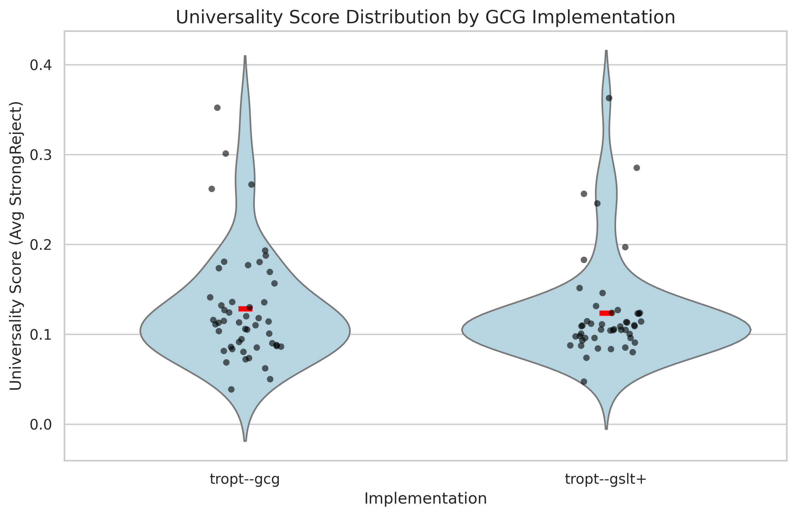

# Reproduction Experiments
In the following experiments, we show TROPT's implementation reproduces other implementation and paper results. We also demonstrate that its flexibility allows us to experiment existing attacks in novel settings.

> Commit SHA: `6839a7542e0d643539dd048d6f20a960a6d019b7`
---

## GCG implementation: TROPT vs. NanoGCG

In this experiment we show that TROPT's GCG implementation successfully reproduces the results from the GCG implementation of NanoGCG [[GCG paper](https://arxiv.org/abs/2307.15043), [NanoGCG code](https://github.com/GraySwanAI/nanoGCG/)].

> Reproducible evaluation script is located at [this NanoGCG fork](https://github.com/matanbt/nanoGCG/blob/main/eval_gcg.py).

**Setup.** We take 15 samples (=harmful instructions) from AdvBench and StrongReject datasets, and target [Gemma2-2b-it](https://huggingface.co/google/gemma-2-2b-it). We run both implementations on multiple seeds, with the hyperparameters specified in the GCG paper. We then compare both the optimization process (by plotting the loss over optimization steps) and the final attack results (average jailbreak rate across all AdvBench instructions).

**Results (Optimization).** We compare the optimization process of both implementations by plotting the loss over optimization time (minutes).

For a specific harmful instruction from AdvBench:

  

Repeating this for more messages:

  

Overall, we see that both implementations show similar optimization trends.

**Results (Final Attack).** We compare the final jailbreak rates (= average StrongReject score on all AdvBench instructions; can be seen as the "universality" score) achieved by both implementations.

  

Again, we see that both implementations achieve similar final attack results.

---

## GASLITE implementation: TROPT vs. GASLITE paper results
> currently in tuning_gaslite script, need to move here.

In these experiments we show that TROPT's GASLITE implementation successfully reproduces the results from the GASLITE paper [[GASLITE paper](https://arxiv.org/abs/2412.20953)] and code [[GASLITE code](https://github.com/matanbt/GASLITE)].

**Setup.** We reproduce the concept specific setup in which a single adversarial passage attack is crafted to target queries of specific concepts; this setup is shown at section ? in the paper. We particularly target (and evaluate) the [e5-base-v2](https://huggingface.co/intfloat/e5-base-v2) embedding model, and follow the same parameters used in the paper.

**Results.** The plot compares the attack success of the paper and TROPT's implementation across the different targeted concepts. The attack success is defined as the rate of held-out queries for which the adversarial passage appears in the top-10 retrieved results.

  
   
  <em>Comparison of TROPT's GASLITE implementation vs. GASLITE paper results in the concept-specific setup.</em>

Overall we spot a slight improvement in TROPT's implementation over the paper results, possibly due to minor implementation differences.

---

## Enhancing GASLITE: GASLITE Variants Comparison

Utilizing TROPT's flexibility, we form various GASLITE variants by combining additional tricks from prior discrete-optimization-based attacks (`GASLITEPlusOptimizer`), we also implement a black-box variant for GASLITE that simply replaces the gradient with a random tensor (`RASLITEPlusOptimizer`) -- calling it *RASLITE*. We compare these variants in the same concept-specific setup as above.

Specifically, we compare:
- **GASLITE**: The original GASLITE optimizer as in the paper.
- **GASLITE+**: GASLITE combined with additional tricks from prior discrete-optimization-based attacks.
- **QGASLITE+**: accelerated GASLITE+ variants, that prefer slight speed improvement over performance.
- **RASLITE+**: A black-box variant of GASLITE+ that replaces the gradient with a random tensor.

**Results.** Show that we can get some gains by combining additional tricks to GASLITE (`GASLITE+`), and that the black-box variant (`RASLITE+`) also performs reasonably well.

  
   
  <em>Comparison of various GASLITE variants in the concept-specific setup.</em>

---
## Enhancing GCG: Using GASLITE for jailbreak
Next, we further utilize the flexibility of TROPT to attack LLMs *using GASLITE* (which was originally designed for embedding models). We compare the performance of GASLITE and GCG in the jailbreak setup above.

**Results.** We do not see improvement neither in convergence, nor in final attack performance by using GASLITE for jailbreak. This may suggest generally that the preferences of embedding models and LLMs are different, and that attacks should be designed (and adapted) accordingly (!).

  
   
  <em>An example optimization process of a harmful instruction from AdvBench; comparing GCG and GASLITE optimizers.</em>

  
   
  <em>Overall, we see that both implementations achieve similar final attack results.</em>

